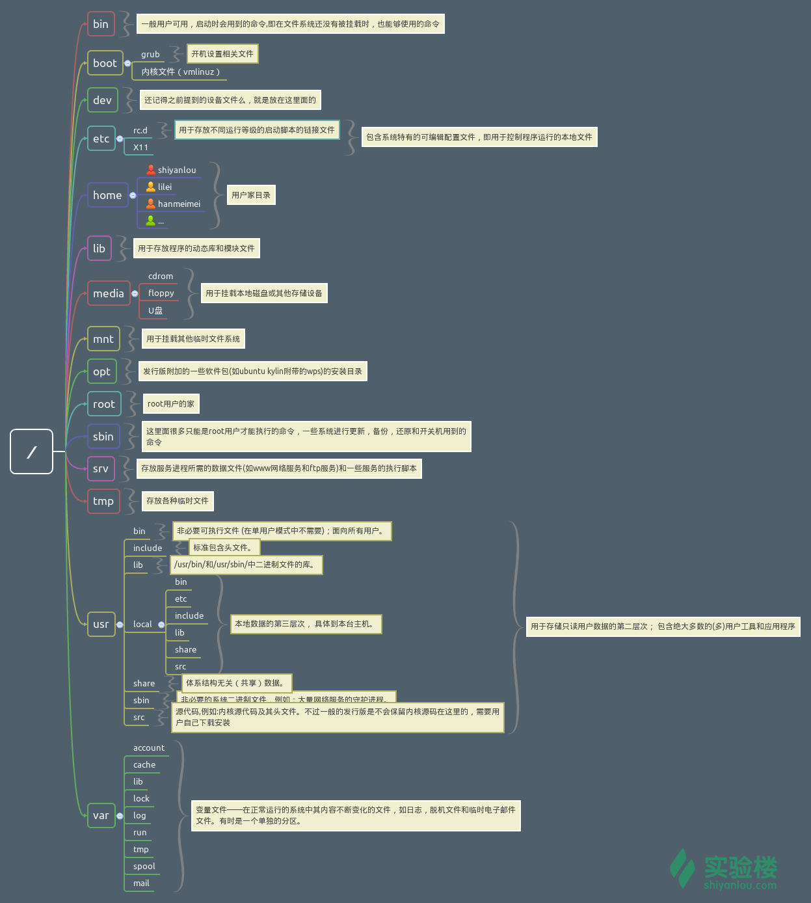

## Linux使用
### 快捷键
Ctrl + a 跳到行首  相当于Home
Ctrl + e 跳到行尾  相当于End

### 通配符
|字符|含义|
|--|--|
|*| 代表任意0个或者多个字符|
|?|代表任意一个或者多个字符|
|[list]| 匹配list中任意单一字符|
|[^list]|匹配除list中的任意字符以外的字符|
|[c1-c2]|匹配c1-c2中任一单一字符如[0-9][a-z]|
|\{string1 , string2,...}|匹配string1或string2其一字符串|
|\{c1...c2}|匹配c1-c2中全部字符，如\{1..10}|

### 帮助

```bash
man <command_name>
```

或者大部分命令有--help这个参数
```bash
ls --help
```
 通常 man 手册中的内容很多，你可能不太容易找到你想要的结果，不过幸运的是你可以在 man 中使用搜索/<你要搜索的关键字>，查找完毕后你可以使用n键切换到下一个关键字所在处，shift+n为上一个关键字所在处。使用Space（空格键）翻页，Enter（回车键）向下滚动一行，或者使用j,k（vim 编辑器的移动键）进行向前向后滚动一行。按下h键为显示使用帮助（因为 man 使用 less 作为阅读器，实为less工具的帮助），按下q退出。
 
 
 
 
```
who am i
```
显示当前用户。

```
sudo adduser ...   添加用户
```

**一个目录同时具有读权限和执行权限才可以打开并查看内部文件，而一个目录要有写权限才允许在其中创建其它文件，这是因为目录文件实际保存着该目录里面的文件的列表等信息。**

### 文件系统




```
file *** 查看文件类型
```

### vim快捷键

|命令|说明|
|:--:|:--:|
|:w 文件名|另存为|
|dd|删除整行|
|d^| 删除至行首|
|d$|删除到行尾|
|ndd|一次删除n行|
|.|重复上次动作|
|u|撤回上次动作|
|n<command\>|重复执行n次command|
|nG|跳转到第n行|
|gg|跳转到第一行|
|G|跳转到最后一行|
|Ctrl + o |回到上次跳转的位置|
|0或^|行首|
|$|行尾|
|yy|复制整行|
|y^|复制至行首|
|y$|复制至行尾|
|p|粘贴在光标后(下)|
|P|粘贴在光标前(上)|
|/+字符串+回车|查找，继续查找可按n(钱向)或者N(后向)|


### 搜索文件

+ where is 简单快速

+ locate 快而全

+ which 确定是否安装了某个软件，只从PATH环境变量中查找

+ find 精而细
 