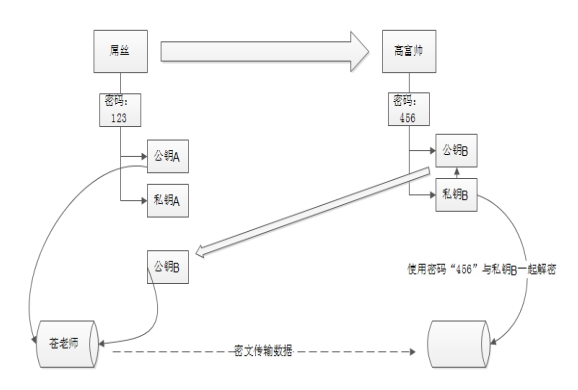

### SSH远程管理服务

#### SSH简介
SSH为Secure Shell缩写。
不应该使用telnet来进行远程管理。
其实很多都是明文进行传输的。如FTP服务。https是加密的。

SSH是进行加密的。

对网卡端口进行监听抓包，就可能将用户名和密码进行盗取。

但是可以使用telnet来测试端口号是否开启。

数据包能够进入公网，那么就相当于是比较安全了。

- SSH端口号：22.
- 安装的服务openSSH.
- 守护进程：sshd.
- 服务端主程序：sshd
- 客户端主程序: ssh

##### 配置文件
`/etc/ssh/ssh_config`
`/etc/ssh/sshd_config`


#### SSH加密原理
使用同一个密钥同时作用信息的加密和解密，这种方法叫做**对称加密(单密钥加密)**

**非对称加密**：使用公钥和私钥来进行加密。在加密的过程中，将一个人的公钥加入，那么这个人使用自己的密码和私钥就能够打开这个文件。不需要知道别人的密码。

在第一次连接一个服务器，会询询问是否下载一个文件，这个文件就是公钥。然后在使用SSH进行通信的时候，就会对数据使用公钥加密。下载的历史公钥放在`~/.ssh/knomn_host`文件中。



#### 常用SSH命令
```bash
ssh USERNAME@IP   #登录IP的用户名为USERNAME
scp USERNAME@IP:PATH    LOCALPATH  #将远程计算机的PATH文件保存在本地的LOCALPATH中

scp LOCALPATH USERNAME@IP:PATH     #上传文件 需要上传或下载文件加需要加-r参数
```

```bash
sftp USER@IP     #登录 然后help可以查看帮助
```

#### 密钥对登录
在服务器端为了服务器的安全，可以将SSH端口进行修改。但是有扫描工具，可以对端口进行扫描。

当然可以在服务器端对端口进行权限设置，只允许某些公网IP能够访问。

但是使用密钥对是比较安全的方式：

- 第一步 在客户端在本地创建本地密钥对
- 第二步 上传公钥文件
- 第三步 导入公钥信息，即公钥库文件：~/.ssh/authorized_keys
- 第四部 使用密钥对验证方式，使用自己的私钥和服务器端的公钥进行直接验证。
- 然后可以直接将使用用户名和密码登录禁用。
