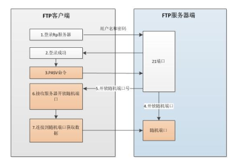

## FTP

### FTP原理简介

FTP(File Transfer Protocol)文件传输协议
C/S类型的服务(client server)

是一种企业级文件共享方式。能够在用户之间共享文件。

主动模式：服务端从20端口主动向客户端发起连接。默认采取主动模式。

被动模式：服务端在制定范围内某个端口等待客户端连接。

#### FTP连接端口

控制连接：TCP 21 发送FTP命令信息
数据连接：TCP 20 上传下载数据

### FTP相关文件

Linux主要使用vsftpd(Very Secure FTP Daemon).

在Ubuntu中配置文件为 `/etc/vsftpd.conf`
