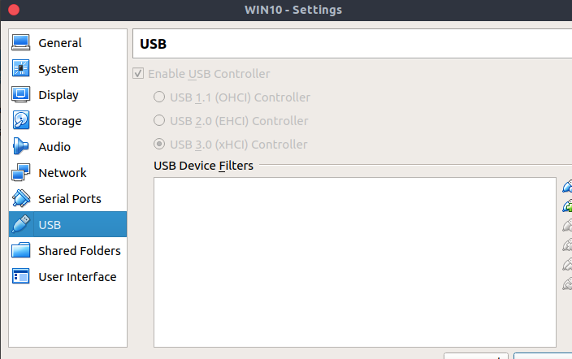

## VirtualBox 使用

### VB中使用USB设备

#### 首先去官网下载一个拓展包

[VB拓展包下载](https://www.virtualbox.org/wiki/Downloads)

然后在`File/Preferences/Extensions`中添加下载好的拓展文件。根据提示安装即可。

#### 将自己的用户名添加virtualbox用户组中

`/user/bin/usermod -G vboxusers -a yourname`

然后输入下面指令查看是否成功

`cat /etc/group | grep vboxusers`

如果显示如下，则成功

`vboxusers:x:128:wangdh`

#### 在VB中启动USB控制器

然后重启宿主机和虚拟机，这时候可以在devices中的USB中查看到存在的USB设备，选择激活即可。

