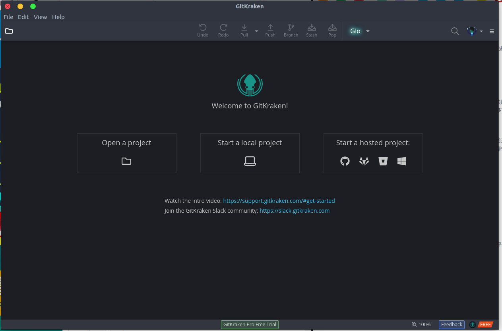

## Git笔记(一)
## 王道烩  2018.9.30

### 1 Git 简介

Git是目前世界上最先进的**分布式版本控制系统**。能够记录一个项目的历史变动信息，记录每次文件的改动，帮助用户结束手动管理多个版本。

Git是Linux之父Linus写的....

#### 1.1 集中式与分布式

集中式版本控制系统是集中存放在中央服务器中，干活是需要先将文件从中央服务器中下载到本地，然后在本地修改完之后推到中央服务器上。必须要联网才能够工作。


分布式控制系统每个人电脑上都是一个完整的版本库，然后将文件修改推动给对方即可。同时还有一个充当中央服务器的电脑，这个服务器的作用仅仅是用来方便交换大家的修改。同事Git还有强大的分支管理。


### 2 Git安装

Linux下之间执行下面的命令即可安装

```bash
sudo apt-get install git
```

同时可以安装GUI Client，`GitKraken`。直接去官网下载安装即可，三大平台均有。



### 3 创建版本库

版本库英文为**repository**。

首先创建一个文件夹，然后通过`git init`来将这个目录变成Git可以管理的仓库。

```bash
mkdir git_test
git init
```

然后可以在文件夹里面看到一个`.git`文件夹，里面有一些控制信息。

如果修改，增加或者删除了一个文件，那么第一步先使用`git add`将文件添加到仓库。

```bash
git add readme.txt
```
可以通过`git add .`将所有修改添加到仓库中。

第二步，通过命令`git commit`命令，后面的`-m`后面是本次提交的说明。

### 4 仓库管理

`git status`可以告诉现在仓库所属的状态。

`git diff  <file name>`可以查看上次`file name`修改的内容。

`git log`能够看到提交日志。其中`HEAD`表示当前版本。`HEAD^`表示上一个版本，`HEAD^^`上上个版本，`HEAD~100`表示往上一百个版本。

使用`git reset`命令将版本回退。

```
git reset --hard HEAD^
```

GIt的版本回退速度非常快，因为Git内部有一个指向当前版本的指正`HEAD`指针，将其指向当前版本。顺便把工作区更新了。


如果回退的过程中，不希望回退，那么可以使用`git reflog`查看每一次命令，前面对应的是版本号。

```bash
9497a60 (HEAD -> master) HEAD@{0}: reset: moving to HEAD^
0435d0c HEAD@{1}: commit: edit
9497a60 (HEAD -> master) HEAD@{2}: commit: edit
7e24527 HEAD@{3}: commit (initial): wrote a read me file
```

然后`git reset`到对应的版本好即可。

### 5 工作区与暂存区

#### 5.1 工作区

工作曲就是电脑里能看到的目录。

#### 5.2 版本库(Repository)

工作区有一个`.git`目录，不算工作区，是Git的版本库。

Git版本库有很多东西，其中一个是被称作stage的暂存区。

第一步使用`git add`把文件添加进去，就是将文件修改添加到暂存区。

第二步使用`git commit`就是提交修改，将暂存区的所有内容提交到当前分支。


### 6 管理修改

Git管理的是修改而不是文件。一个修改必须使用`add`添加到暂存区之后，才能够通过`git commit`提交到版本库。

可以使用`git diff HEAD  -- readme.txt `来查看工作区和版本库里面最新版的区别。

### 7 撤销修改

如果在工作区对一个文件修改之后，发现不想修改，那么可以使用下面命令来撤销

`git chechout -- file`

但是如果已经对修改的文件进行了修改，并添加到的暂存区了，那么这条命令只能撤销到添加到暂存区后的状态。

如果想把添加到暂存区的修改撤销，可以先使用`git reset HEAD <file>`，然后使用`git checkout -- file`。个人理解第一条指令是将版本库的内容放到暂存区，然后第二条命令是将暂存区的内容放到工作区的。

### 8 删除文件

如果直接在工作区使用rm删除了一个文件之后，可以使用`git rm`确定要删除这个文件，然后使用`git commit`提交。

如果删除之后不想删除，那么可以使用`git checkout -- file`就可以恢复到版本库。

### 9 远程仓库

Git是一种分布式管理系统，可以使用一台电脑充当服务器的角色，每天24小时开机，然后其他每个人都从这个服务器仓库克隆一份到自己的电脑上，并且各自把自己的修改推送到服务器仓库中，也从服务器中拉取别人的提交。

可以自己搭建一个Git服务器，下面会有介绍。

具体如何进行远程仓库管理见一下链接。
[远程仓库管理](https://www.liaoxuefeng.com/wiki/0013739516305929606dd18361248578c67b8067c8c017b000/001374385852170d9c7adf13c30429b9660d0eb689dd43a000)

### 10 分支管理

关于分支的理解，可以参考下面的网站。[分支理解](https://www.liaoxuefeng.com/wiki/0013739516305929606dd18361248578c67b8067c8c017b000/001375840038939c291467cc7c747b1810aab2fb8863508000)

分支常用的命令：

- 查看分支：`git branch`
- 创建分支：`git branch <name>`
- 切换分支：`git checkout <name>`
- 合并某分支到当前分支：`git merge <name>`
- 删除分支：`git branch -d <name>`

一般分支使用情况：

- 在修复Bug的时候，可以创建一个分支，在Bug修复之后，合并分支，删除分支。
- 希望增加新的功能的时候，可以先增加一个feature分支，然后merge。

### 11 Tag标签

可以在合适的位置打上标签，这样便于回滚。利用tag打标签只能通过tag找到commit id，然后通过这个id回滚。
